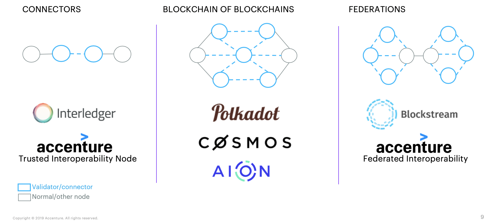
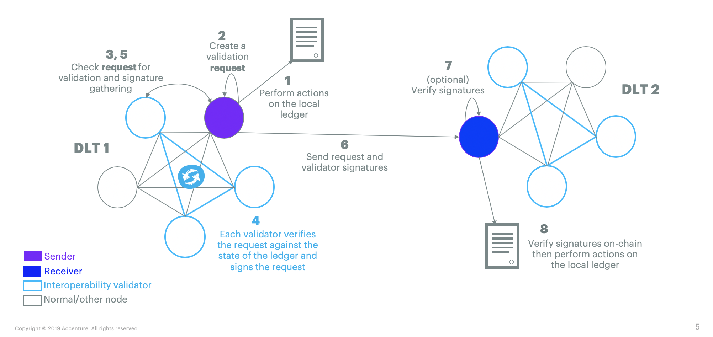
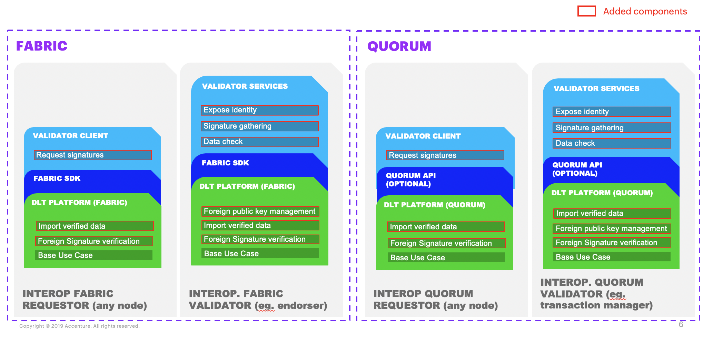

# Lab Name
Honeycomb

# Short Description
Federated Interoperability

# Scope of Lab
Define a communication model to enable permissioned blockchain ecosystems to exchange any type of data (shared data) or custom asset (fungible/non fungible) independently from the platform (e.g. Hyperledger Fabric, Quorum, etc.) without a middleman. This lab will implement an interoperability validators network, which is an an overlay network of hand-picked actors that will validate and sign data before sharing.

## Interoperability Space
If you look at the Interoperability space, a number of different approaches have been taken. This lab is part of the federation space, represented below as Accenture Federated Interoperability.

## Design Principles
1. Support multiple blockchain platforms - The model should be usable on as many smart contract blockchains as possible.
1. Direct transfer between requestors - The requestors of the transfer should be at the middle of the transaction with proofs so that they can interact as if they were on the same platform.
1. Flexible requirements and data protocols - Data-level protocols and standards can be adapted to the required level of confidence and use case of the chains rather than applying the same data protocol for all.
1. Leverage pre-existing roles - Shape the model around existing roles in permissioned blockchain ecosystems to safeguard incentives, governance, and ecosystem properties.
1. Pluggable model and components - Ability to implement the model in already running blockchain by extending existing on-chain logic or workflow while limiting the impact on running and established logic.

## High-Level Workflow
Interoperability Validators are known or broadly discoverable by the ecosystem and are typically existing nodes taking part in the governance or consensus of the ecosystem. Interoperability Validators will handle export requests from local nodes by verifying against their version of the ledger before broadcasting the request to the validators network. Each request is answered by the (configurable) minimum quorum of signatures necessary or rejected as fast as possible. Even if some of the validators are down, or not participating, the network can continue working while minimum quorum is sustained.

## High-Level Architecture

## Future Work
1. Data Level Protocols for Interoperability Use Cases - As it stands we can prove that something happened on a foreign distributed ledger. For more complex interoperability use cases (e.g. asset transfer, atomic swap, asset synchronization), we want data protocols defining the steps and verifications needed from the validators.
1. Identity System for the Broader Ecosystem - Validator identity verification is at the backbone of the solution. We want ecosystems to be able to discover foreign validators and store their identity in a reliable way. Potential lead: Distributed ledger for identity (e.g., Indy, Sovrin).
1. Confidentiality Enabled Federation Communication - Communication between validators is based on broadcasting. We want the validator network to understand and match the confidentiality setup of the local ledger.
1. Platform Plug-Ins and Performance Testing - We want to implement plugins and on-chain logic for more platforms (e.g. Hyperledger Sawtooth, Digital Asset, Corda). We want to test our existing solution to a sized network to test scalability.
1. On-Chain Integration Logic - We want to perform actions as a follow-up to foreign data verification. Implement on-chain logic that can make sense of the incoming data and format it in a understandable way for the local ledger.

# Initial Committers
_Enter the Github IDs for the set of initial committers._
- https://github.com/tkuhrt
- https://github.com/jonathan-m-hamilton
- https://github.com/petermetz
- https://github.com/<user_id4>
- ...

# Sponsor
_Provide the name of your sponsor. A sponsor is required and must be a maintainer of one of the Hyperledger projects, a TSC member, or a WG chair._
- https://github.com/<user_id> or Name (email@example.org) - Role (e.g., "Chair of the XXX workgroup")

# Pre-existing repository
None
